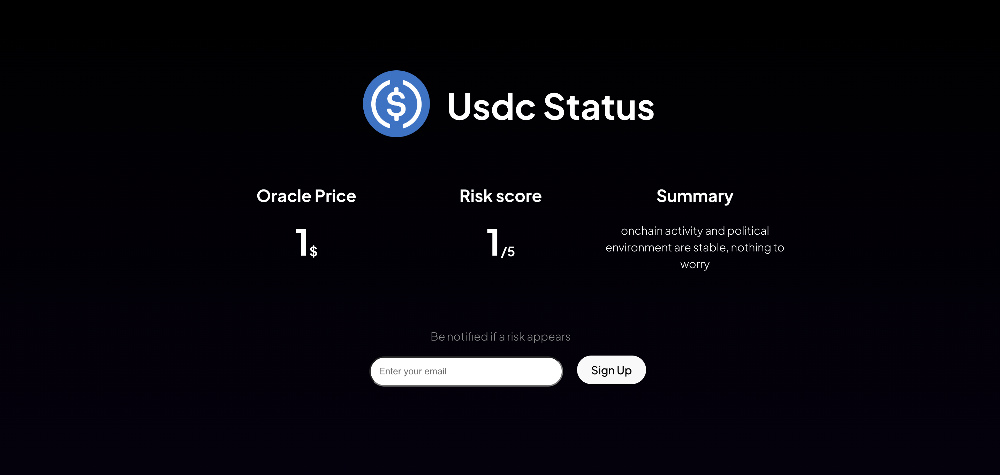

# StableSafe

A prediction market to alert you in case of depeg on stablecoins.

## Folder Architecture

- [/contracts](./contracts/): the predictor's contracts, with staking and user subscription
- [/autonomous-predictor](./autonomous-predictor/): the code to setup a remote predictor running 24/7 
- [/data](./data/) : contain various dataset - required to become a predictor
- /src : the code of the frontend app

## Tokenomics

- The token is a ERC20 with a fixed supply of 100 000 000 tokens
- It's deployed on Celestia with dymension (waiting for froopyland devnet deployment)
- To access prediction, a user has to stake
- A predictor has to be whitelisted by the community (after submitting a proof of quality)
- A predictor can submit "stakedPrediction", that requires a stake and that notify users
- Users votes to confirm that the prediction was insightful and reward the predictor

## Setup a predictor

- You can setup a predictor using see the associated [README.md](./autonomous-predictor/README.md)
